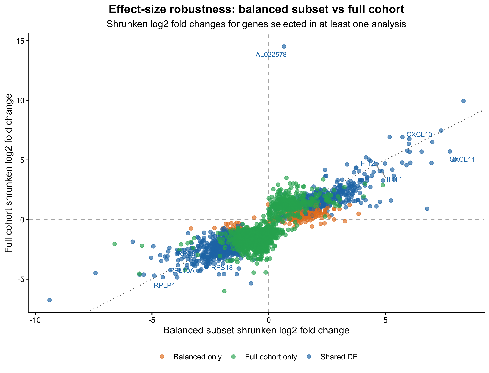
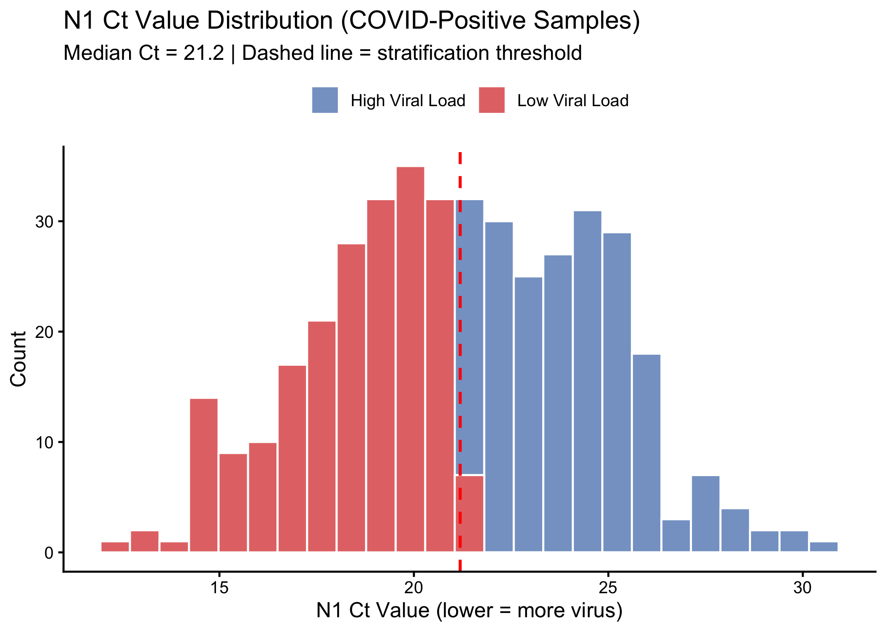
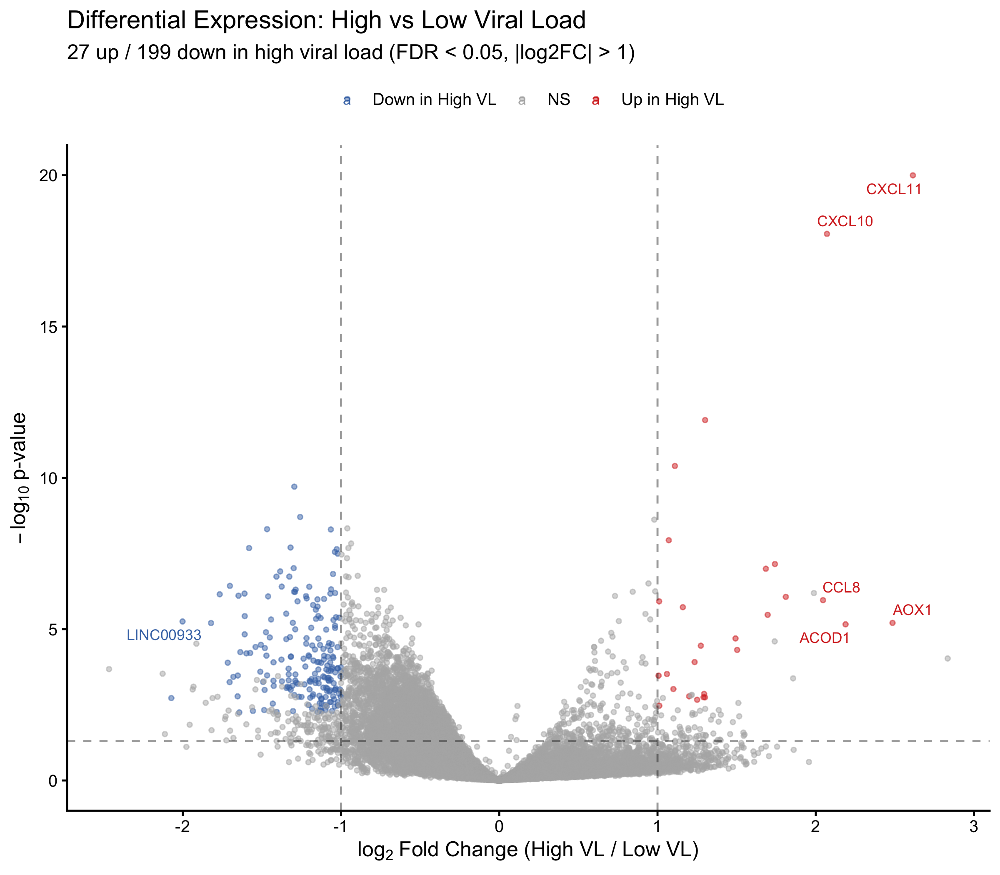
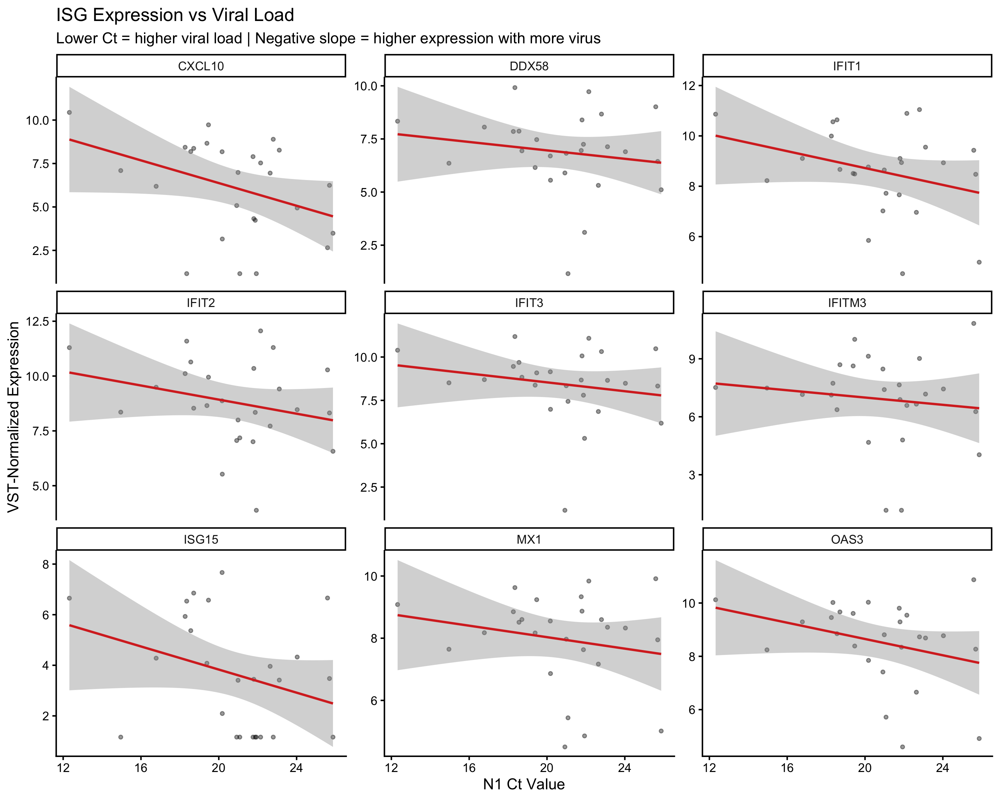
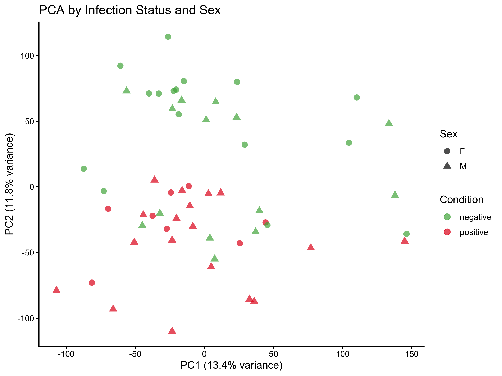
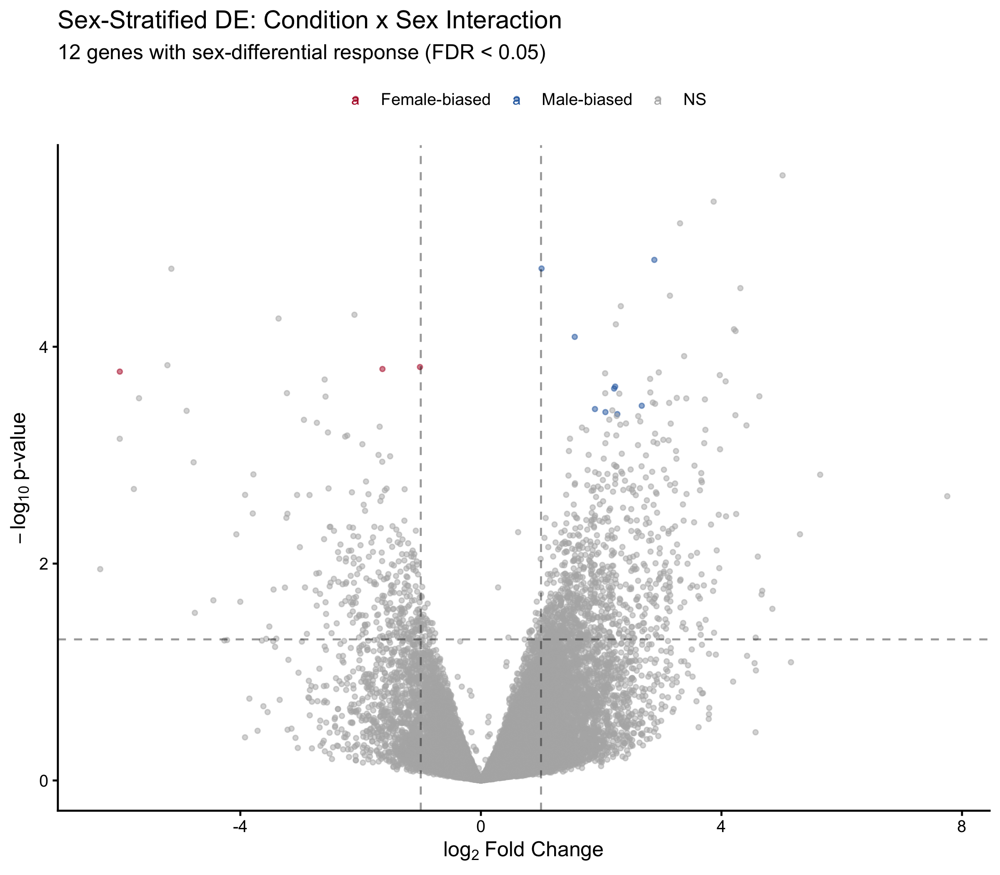

# SARS-CoV-2 Host Response in Nasopharyngeal RNA-seq (GSE152075)

[](https://www.r-project.org/)
[](https://opensource.org/licenses/MIT)
[](https://doi.org/10.5281/zenodo.19429954)
[](https://github.com/Ekin-Kahraman/bulk-rnaseq-differential-expression/actions/workflows/ci.yml)

Reproducible bulk RNA-seq differential expression pipeline using DESeq2: QC, shrunken-effect DE analysis, pathway enrichment, and robustness benchmarking against the full QC-passed cohort.

## Highlights

- Processed GEO [GSE152075](https://www.ncbi.nlm.nih.gov/geo/query/acc.cgi?acc=GSE152075) (n = 484 nasopharyngeal swabs) to a balanced subset (n = 60) for the primary differential expression analysis
- Identified **1,773 thresholded DE genes** in the balanced subset (FDR < 0.05, |log₂FC| > 1), dominated by canonical interferon-stimulated genes
- Full-cohort sensitivity analysis identified **4,378 thresholded DE genes**, with **1,266** shared with the balanced analysis and **99.8%** effect-direction concordance
- Enriched pathways: GO "response to virus", KEGG "Coronavirus disease - COVID-19" (FDR = 4.5e-39)
- **Extended: Viral load stratification** — COVID-positive samples stratified by N1 Ct value into high/low viral load groups with independent DE analysis and continuous ISG–Ct correlation, extending the original continuous regression approach with a group-comparison framework
- **Extended: Sex-stratified interaction analysis** — Condition-by-sex interaction model (`~ condition * gender`) to identify genes with sex-differential transcriptional responses, complementing the original study's sex-adjusted analysis with a formal interaction test
- Extracts full GEO covariates (viral load Ct, age, sex, sequencing batch) for covariate-aware analyses
- Raw and shrunken DE outputs, analysis summary metrics, and git/session provenance are generated automatically
- `results/tables/output_manifest.csv` records file sizes and checksums for committed figures and tables

## Workflow

```
GSE152075 (n=484, GEO)
    │
    ▼
 00 Download ────── Fetch counts + metadata from GEO, extract covariates (Ct, age, sex, batch)
    │
    ▼
 01 QC ──────────── Library size filtering (>100k reads), gene filtering (CPM ≥1 in ≥10 samples)
    │
    ▼
 02 PCA ─────────── VST (blind=TRUE) → PCA for sample-level exploratory analysis
    │
    ▼
 03 DE ──────────── Balanced subset (n=60) → DESeq2 (~ condition + gender) → apeglm shrinkage
    │
    ├──→ 04 Sensitivity ─── Full cohort (n=484) DE → concordance check (99.8% sign agreement)
    ├──→ 05 Diagnostics ─── Cook's distance, dispersion, MA, volcano, scree
    ├──→ 06 Enrichment ──── GO/KEGG via clusterProfiler (top KEGG: "Coronavirus disease", FDR=4.5e-39)
    ├──→ 08 Viral load ──── High/low Ct stratification → independent DE + ISG-Ct correlation
    └──→ 09 Sex interaction ── ~ condition * gender → 12 sex-biased genes (9 male, 3 female)
         │
         ▼
      12 Manifest ────── File-size and checksum manifest for committed figures/tables
         │
         ▼
      07 Provenance ──── Git commit, session info, config, package versions → results/session_info.txt
```

## Methods Overview

- Bulk RNA-seq preprocessing and quality control
- Differential expression modelling with DESeq2 (`~ condition + gender`) plus `apeglm` log2 fold-change shrinkage
- Variance-stabilising transformation (VST) for visualisation
- Functional enrichment analysis (GO/KEGG)
- Full-cohort robustness benchmark against the balanced subset
- Viral load stratification: median-split DE analysis of high vs low viral load patients
- Sex-stratified interaction model: `~ condition * gender` to identify sex-differential host responses
- Reproducible analysis workflow (pinned dependencies via `renv`, fixed seeds, pinned KEGG snapshot, git/session provenance)

## Dataset

**Reference:**  
Lieberman NAP, Peddu V, Xie H, Shrestha L, Huang M-L, Mears MC, *et al.* (2020)  
*In vivo antiviral host transcriptional response to SARS-CoV-2 by viral load, sex, and age*  
**PLoS Biology** 18(9): e3000849  
**DOI:** [10.1371/journal.pbio.3000849](https://doi.org/10.1371/journal.pbio.3000849)

| Parameter | Value |
|:----------|:------|
| Platform | Illumina NovaSeq 6000 |
| Organism | *Homo sapiens* |
| Sample type | Nasopharyngeal swabs |
| Total samples | 484 (430 positive, 54 negative) |
| Analysis subset | 60 (30 per group, balanced) |

Balanced subset controls for class imbalance and viral load heterogeneity. Subsampling uses `set.seed(123)` for reproducibility, and a separate full-cohort sensitivity analysis quantifies how much of the inferred signal persists outside the balanced subset.

## Results

### Quality Control


Library sizes comparable between groups (median ~20M reads), supporting robust normalisation.

### Principal Component Analysis


PC1 (33% variance) partially separates infected from control samples. Overlap reflects biological heterogeneity in nasopharyngeal samples and variation in host immune activation. VST was applied to stabilise variance prior to PCA.


### Differential Expression


**1,773 thresholded DE genes** (FDR < 0.05, |log₂FC| > 1): 979 upregulated, 794 downregulated

Results are dominated by interferon-stimulated genes (ISGs) characteristic of antiviral immunity. Ranking and volcano visualization use shrunken log2 fold changes to stabilize effect-size estimates for lower-count genes while preserving the raw significance calls.

### Representative Induced Genes

The most consistently induced genes include **IFIT1/2/3, CXCL10, DDX58, GBP1, OAS3, XAF1, and SIGLEC1**. These genes anchor the interpretation around interferon signaling, viral RNA sensing, and downstream antiviral effector programs rather than isolated single-gene effects.

### Model Diagnostics


MA plot shows symmetric fold change distribution with appropriate shrinkage.


Dispersion estimates showing gene-wise dispersion fitted to the mean-dispersion trend.


Sample clustering by Euclidean distance shows partial separation consistent with infection status.


Hierarchical clustering of top 50 DE genes shows consistent expression patterns within conditions.

### Pathway Enrichment

**397 GO Biological Process terms** and **23 KEGG pathways** significantly enriched (FDR < 0.05).


Top GO terms: cytoplasmic translation, response to virus, defense response to virus.


Top KEGG pathway: **Coronavirus disease - COVID-19** (FDR = 4.5×10<sup>-39</sup>), followed by Ribosome and NOD-like receptor signalling.

### Robustness Check



The full QC-passed cohort analysis (n = 484) identified **4,378 thresholded DE genes**. Of these, **1,266** overlap with the balanced-subset DE set, with **99.8%** shared effect-direction concordance and a Spearman correlation of **0.812** between shrunken effect sizes across shared genes. The balanced subset therefore increases contrast, but the main direction of effect is preserved in the larger cohort.

### Viral Load Stratification (Extended)



COVID-positive samples stratified by median N1 Ct value into high viral load (low Ct) and low viral load (high Ct) groups. DE analysis between groups tests the hypothesis that high and low viral load patients activate distinct immune programs.



Genes differentially expressed between high and low viral load groups. Upregulated genes in the high viral load group are expected to include interferon-stimulated genes (ISGs), consistent with dose-dependent innate immune activation.



Continuous correlation between N1 Ct value and ISG expression. Negative slopes indicate higher expression with higher viral load (lower Ct), supporting a viral-load-dependent interferon response gradient rather than a binary on/off activation.

### Sex-Stratified Analysis (Extended)



PCA of samples coloured by infection status and shaped by sex, visualising potential sex-dependent clustering in the host transcriptional response.



Genes with significant condition-by-sex interaction (FDR < 0.05), representing genes where the transcriptional response to SARS-CoV-2 differs between males and females. This is clinically relevant given the approximately 1.7-fold higher COVID-19 mortality in males (Peckham *et al.*, 2020).

### ISG Signalling Cascade


Schematic of the RIG-I -> IFN -> ISG antiviral cascade. Viral RNA detection by DDX58 (RIG-I) triggers interferon production and downstream activation of antiviral effectors.

## Biological Interpretation

The transcriptional profile is consistent with an upper-airway interferon-driven antiviral host response. Canonical ISGs such as IFIT1/2/3, OAS3, DDX58, CXCL10, GBP1, and SIGLEC1 support activation of RNA-sensing and interferon-response programs expected during acute viral infection. The pathway results are consistent with the same interpretation, with strong enrichment for antiviral and coronavirus-associated gene sets.

The interpretation should remain conservative. This signature is consistent with acute SARS-CoV-2 infection in nasopharyngeal samples, but it is not uniquely SARS-CoV-2-specific and should not be interpreted as direct proof of cell-intrinsic mechanism or pathway activation in every cell type. The balanced subset was chosen to reduce class imbalance and viral-load heterogeneity. The full-cohort sensitivity analysis shows that the direction of effect is highly stable, which strengthens the inference, but the biological claims should remain framed as a robust host-response signature rather than a definitive mechanistic model.

## Quick Start
```sh
# Install/restore dependencies (first time only)
Rscript 000_install_dependencies.R

# Run complete pipeline
Rscript run_all.R
```

Analysis runtime: ~7-10 min after data download (~2GB), depending on CPU and CI runner load.

### Notes
- To re-download the GEO dataset (otherwise the pipeline reuses existing `data/*.rds` outputs): `FORCE_DOWNLOAD=true Rscript scripts/00_get_data.R`
- KEGG enrichment uses the pinned human pathway snapshot in `data/reference/` so routine rebuilds do not silently change when KEGG updates upstream.
- Lint: `Rscript dev/lint.R`
- Tests: `Rscript -e 'testthat::test_dir("tests/testthat")'`
- Workflow benchmark: see `WORKFLOW_BENCHMARK.md`
- Reproducibility details (expected outputs, network requirements): see `REPRODUCIBILITY.md`

## Data and Code Availability
- Source data: GEO accession [GSE152075](https://www.ncbi.nlm.nih.gov/geo/query/acc.cgi?acc=GSE152075)
- Analysis code: this repository (MIT licence)
- Frozen software environment: `renv.lock`
- Key derived outputs: `results/figures/` and `results/tables/`

## Peer Review Checklist
Run from the repository root:
```sh
Rscript 000_install_dependencies.R
Rscript run_all.R
Rscript -e 'renv::status()'
Rscript dev/lint.R
Rscript -e 'testthat::test_dir("tests/testthat")'
```

Maintainers updating dependencies should refresh the lockfile explicitly:
```sh
Rscript dev/snapshot_lockfile.R
```

## Citation Metadata
- Zenodo DOI: `10.5281/zenodo.19429954`
- For citation tooling, see `CITATION.cff`

## Project Structure
```
bulk-rnaseq-differential-expression/
├── .github/
│   └── workflows/
│       └── ci.yml               # CI (renv status, lint, tests, rebuild validation)
├── .lintr                       # lintr configuration
├── .Rprofile                    # renv autoloader
├── 000_install_dependencies.R   # Install all required packages
├── CITATION.cff
├── REPRODUCIBILITY.md
├── WORKFLOW_BENCHMARK.md
├── dev/
│   ├── lint.R                   # Lint scripts/ via lintr
│   └── snapshot_lockfile.R      # Maintainer-only renv.lock refresh
├── renv/
│   ├── activate.R
│   └── settings.json
├── renv.lock
├── run_all.R                    # Run complete pipeline
├── scripts/
│   ├── 00_get_data.R
│   ├── 01_qc.R
│   ├── 02_pca.R
│   ├── 03_deseq2.R
│   ├── 04_visualisation_volcano.R
│   ├── 05_model_diagnostics.R
│   ├── 06_enrichment.R
│   ├── 07_reproducibility.R
│   ├── 08_pathway_diagram.R
│   ├── 09_sensitivity_analysis.R
│   ├── 10_viral_load_stratification.R  # Extended: high vs low viral load DE
│   ├── 11_sex_stratified_analysis.R    # Extended: condition x gender interaction
│   ├── 12_output_manifest.R     # Checksums for committed figures/tables
│   └── config.R                 # Shared analysis thresholds and helpers
├── data/
│   └── [RDS files]
├── results/
│   ├── figures/
│   └── tables/
├── tests/
│   └── testthat/
├── LICENSE
└── README.md
```

## Individual Scripts
```r
source("scripts/00_get_data.R")
source("scripts/01_qc.R")
source("scripts/02_pca.R")
source("scripts/03_deseq2.R")
source("scripts/04_visualisation_volcano.R")
source("scripts/05_model_diagnostics.R")
source("scripts/06_enrichment.R")
source("scripts/07_reproducibility.R")
source("scripts/08_pathway_diagram.R")
source("scripts/09_sensitivity_analysis.R")
source("scripts/10_viral_load_stratification.R")
source("scripts/11_sex_stratified_analysis.R")
source("scripts/12_output_manifest.R")
```

## Methods

### Quality Control
- Minimum library size: 100,000 reads
- Gene filtering: CPM ≥ 1 in ≥10 samples
- Final: 14,220 genes tested
- Balanced sampling: 30 per group (seed = 123)

### Statistical Analysis
- Normalisation: DESeq2 median-of-ratios
- Transformation: Variance-stabilising transformation (VST) for visualisation
- Effect-size stabilisation: `apeglm` shrinkage for ranking/visualisation
- Testing: Wald test with Benjamini-Hochberg correction
- Thresholds: FDR < 0.05, |log₂FC| > 1 for the reported summaries; full results tables are provided for alternative thresholding

### Robustness Analysis
- Secondary DE run on the full QC-passed cohort (n = 484)
- Summary outputs written to `results/tables/full_cohort_deseq2_results.csv` and `results/tables/analysis_summary.csv`
- Effect-size concordance visualised in `results/figures/sensitivity_lfc_scatter.png`

### Enrichment Analysis
- Gene ID conversion: Symbol to Entrez (96% mapped)
- GO: Biological Process, BH-corrected
- KEGG: Human pathways (hsa)

## Limitations

- Nasopharyngeal samples only; may not reflect lower respiratory tract
- Primary inference uses `~ condition`; covariate-aware analyses (viral load, sex) are provided as secondary explorations
- Viral load stratification uses a median split, which loses information compared to continuous modelling
- Sex-stratified interaction model may be underpowered for smaller subgroups
- The balanced subset improves comparability, but the full cohort remains heterogeneous and likely reflects cell-composition shifts as well as transcriptional regulation
- Cross-sectional design; no temporal dynamics
- Future extensions: batch correction assessment, cell-type deconvolution, or integration with scRNA-seq

## Requirements

### Dependencies (renv)
This project uses `renv` for reproducible dependencies. Install/restore everything with:
```sh
Rscript 000_install_dependencies.R
```

This command restores the pinned project library only; it does not modify `renv.lock`.

### Manual installation (optional)
If you prefer to install packages manually instead of using `renv`:

#### Bioconductor
```r
BiocManager::install(c(
  "DESeq2", "edgeR", "GEOquery",
  "clusterProfiler", "org.Hs.eg.db", "enrichplot"
))
```

#### CRAN
```r
install.packages(c("ggplot2", "ggrepel", "dplyr", "pheatmap", "RColorBrewer"))
```

### System
- R ≥ 4.0
- 8GB RAM recommended
- ~2GB storage for GEO data

## Reproducibility

Session info recorded in `results/session_info.txt`. All random processes use fixed seeds.

## Licence

MIT

## How to Cite

This repository:
> Kahraman, E. (2026). SARS-CoV-2 Host Response in Nasopharyngeal RNA-seq. Zenodo. https://doi.org/10.5281/zenodo.19429954

Data from:
> Lieberman NAP *et al.* (2020) In vivo antiviral host transcriptional response to SARS-CoV-2 by viral load, sex, and age. *PLoS Biology* 18(9): e3000849. DOI: [10.1371/journal.pbio.3000849](https://doi.org/10.1371/journal.pbio.3000849)

## Author

**Ekin Kahraman**  
Molecular Biology & Genetics  
January 2026
