# SARS-CoV-2 Host Response in Nasopharyngeal RNA-seq (GSE152075)

[](https://www.r-project.org/)
[](https://opensource.org/licenses/MIT)
[](https://doi.org/10.5281/zenodo.18432519)

Reproducible bulk RNA-seq differential expression pipeline using DESeq2: QC, PCA, ~1,900 DE genes, ISG enrichment, and mechanistic interpretation of antiviral host responses.

## Highlights

- Processed GEO [GSE152075](https://www.ncbi.nlm.nih.gov/geo/query/acc.cgi?acc=GSE152075) (n=484 nasopharyngeal swabs) → balanced subset (n=60) for robust DE analysis
- Identified **1,902 DE genes** (FDR < 0.05, |log₂FC| > 1), dominated by interferon-stimulated genes (IFIT1/2/3, OAS3, DDX58)
- Enriched pathways: GO "response to virus", KEGG "Coronavirus disease – COVID-19" (FDR = 1.5×10<sup>-40</sup>)
- Full reproducible R workflow (DESeq2, clusterProfiler) with modular scripts and fixed seeds
- Results align with Lieberman *et al.* (2020), who reported viral-load-dependent ISG induction

## Skills Demonstrated

- Bulk RNA-seq preprocessing and quality control
- Differential expression modelling with DESeq2
- Variance-stabilising transformation (VST) for visualisation
- Functional enrichment analysis (GO/KEGG)
- Reproducible bioinformatics workflows

## Dataset

**Reference:**  
Lieberman NAP, Peddu V, Xie H, Shrestha L, Huang M-L, Mears MC, *et al.* (2020)  
*In vivo antiviral host transcriptional response to SARS-CoV-2 by viral load, sex, and age*  
**PLoS Biology** 18(9): e3000849  
**DOI:** [10.1371/journal.pbio.3000849](https://doi.org/10.1371/journal.pbio.3000849)

| Parameter | Value |
|:----------|:------|
| Platform | Illumina NovaSeq 6000 |
| Organism | *Homo sapiens* |
| Sample type | Nasopharyngeal swabs |
| Total samples | 484 (430 positive, 54 negative) |
| Analysis subset | 60 (30 per group, balanced) |

Balanced subset controls for class imbalance and viral load heterogeneity. Subsampling uses `set.seed(123)` for reproducibility.

## Results

### Quality Control

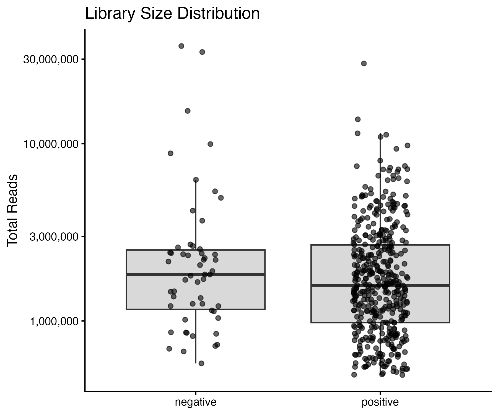

Library sizes comparable between groups (median ~20M reads), supporting robust normalisation.

### Principal Component Analysis

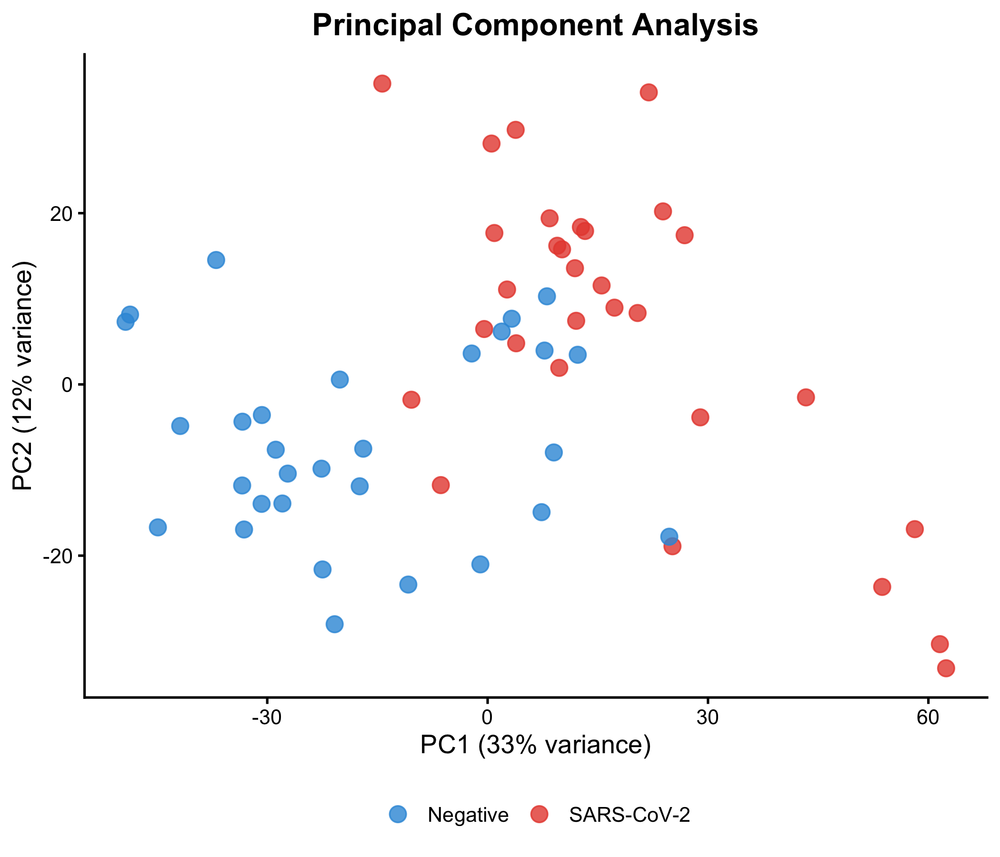

PC1 (33% variance) partially separates infected from control samples. Overlap reflects biological heterogeneity in nasopharyngeal samples and variation in host immune activation. VST was applied to stabilise variance prior to PCA.

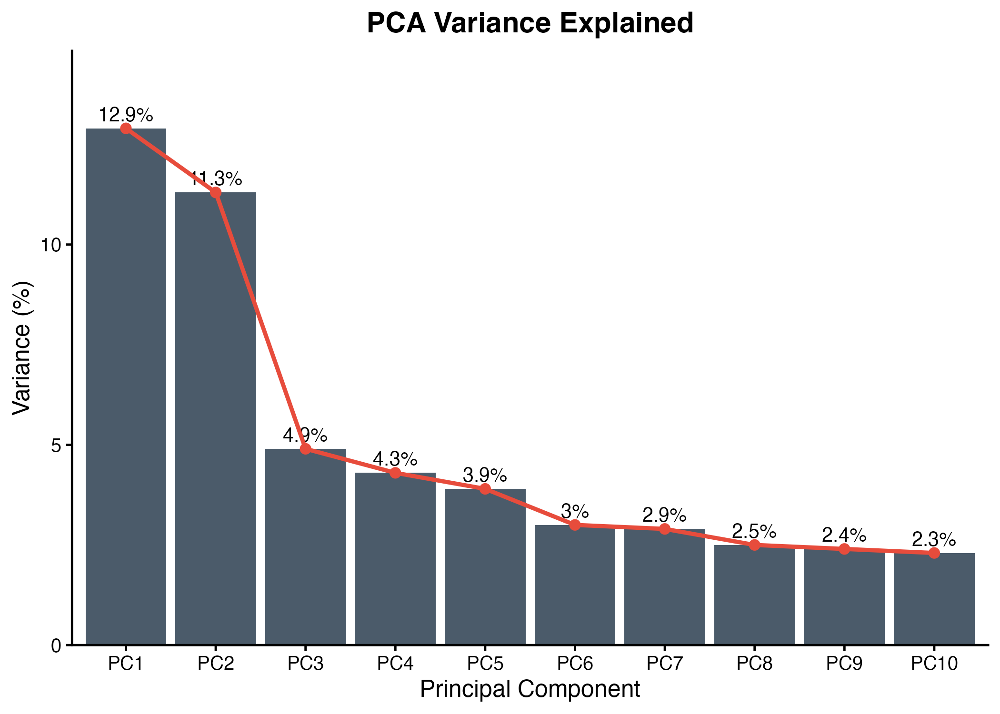

### Differential Expression

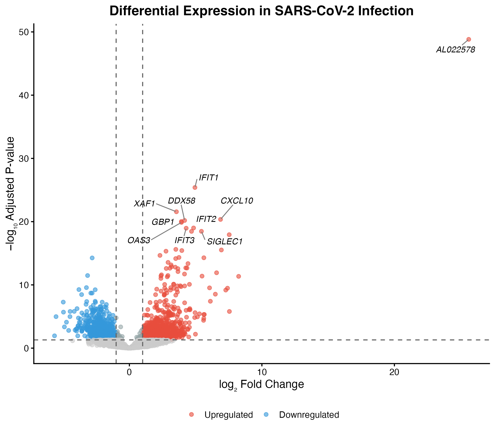

**1,902 DE genes** (FDR < 0.05, |log₂FC| > 1): 1,099 upregulated, 803 downregulated

Results dominated by interferon-stimulated genes (ISGs) characteristic of antiviral immunity.

### Top ISGs by Effect Size

| Gene | Function | log₂FC | FDR |
|:-----|:---------|-------:|----:|
| IFIT1 | Translation inhibitor | 3.5 | <10<sup>-20</sup> |
| IFIT2 | Translation inhibitor | 3.2 | <10<sup>-18</sup> |
| IFIT3 | Translation inhibitor | 3.1 | <10<sup>-17</sup> |
| OAS3 | 2'-5'-Oligoadenylate synthetase | 3.0 | <10<sup>-17</sup> |
| CXCL10 | IFN-inducible chemokine | 2.9 | <10<sup>-20</sup> |
| DDX58 | RIG-I (viral RNA sensor) | 2.8 | <10<sup>-19</sup> |
| GBP1 | Guanylate-binding protein | 2.7 | <10<sup>-19</sup> |

### Model Diagnostics

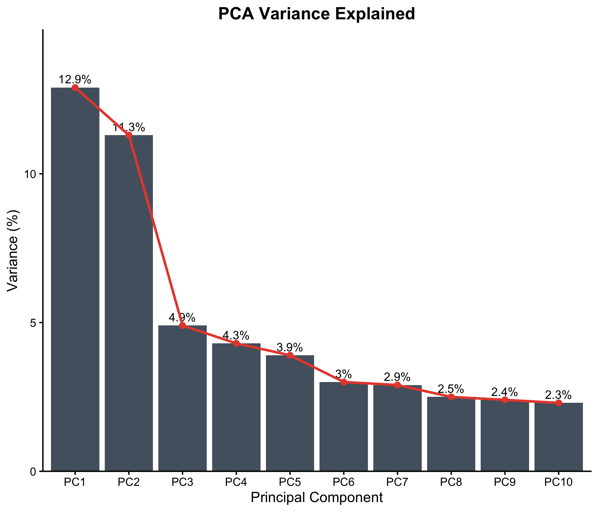

MA plot shows symmetric fold change distribution with appropriate shrinkage.

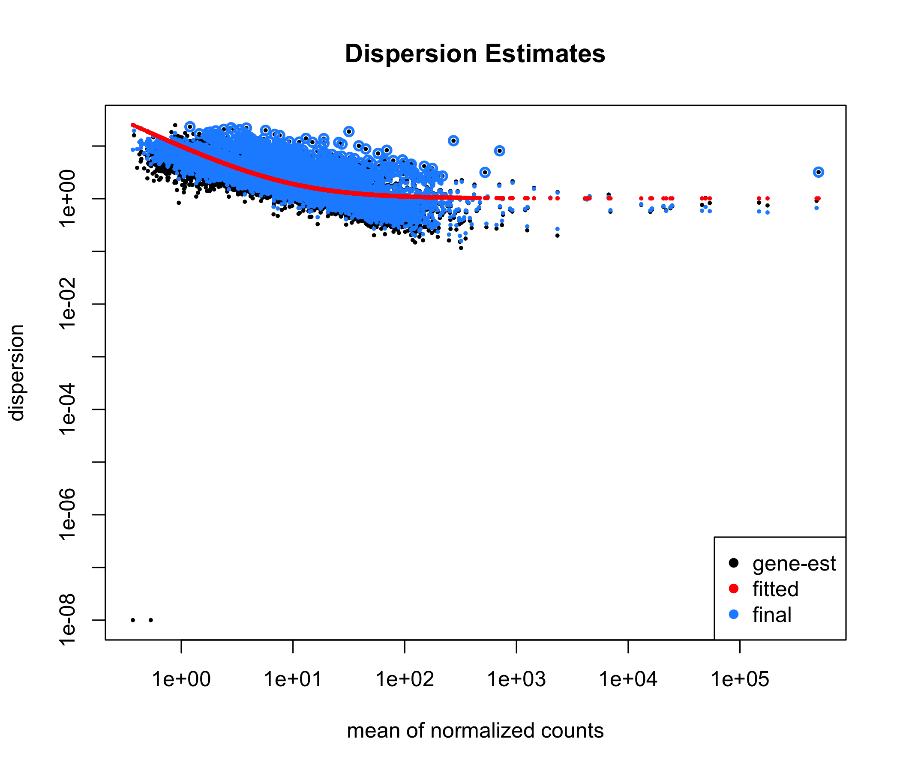

Dispersion estimates showing gene-wise dispersion fitted to the mean-dispersion trend.

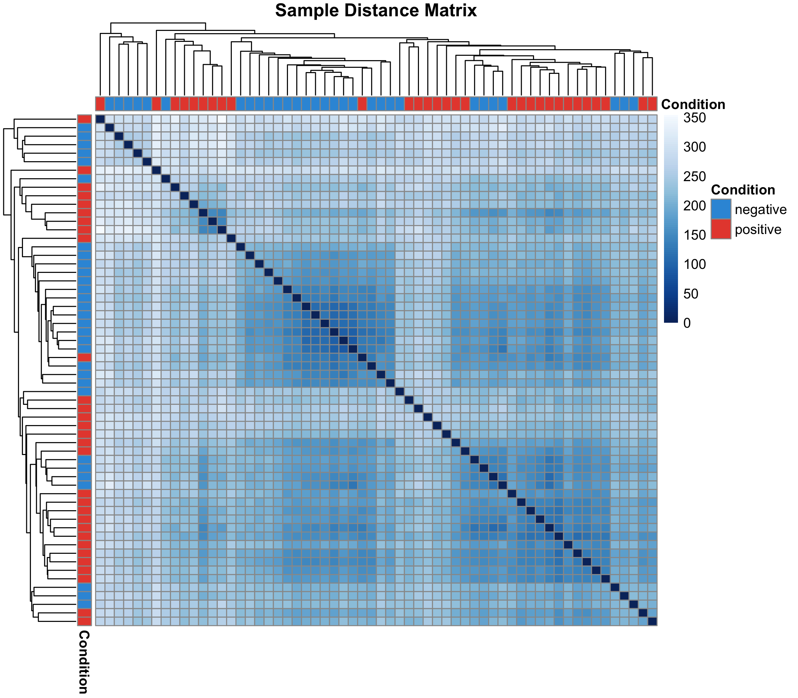

Sample clustering by Euclidean distance shows partial separation consistent with infection status.

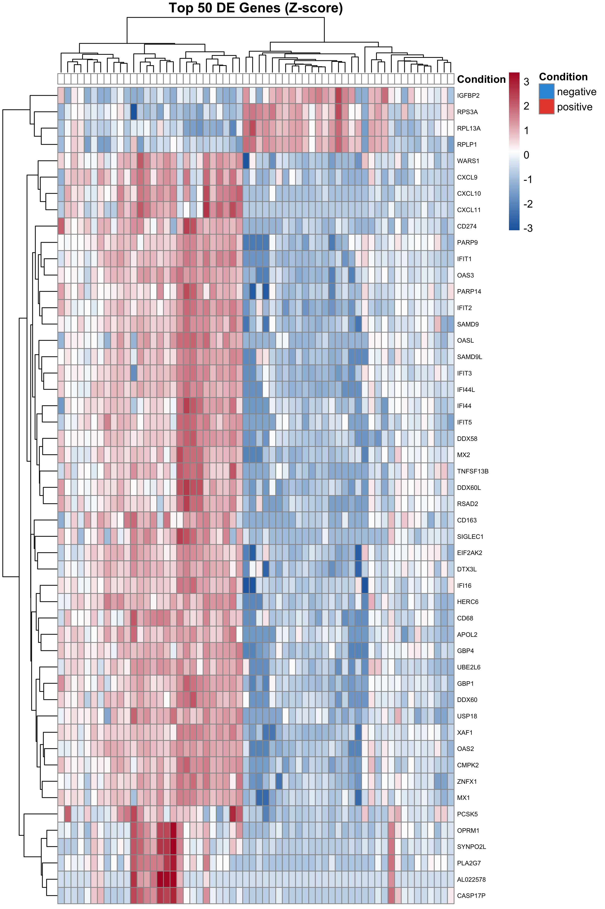

Hierarchical clustering of top 50 DE genes shows consistent expression patterns within conditions.

### Pathway Enrichment

**529 GO Biological Process terms** and **28 KEGG pathways** significantly enriched (FDR < 0.05).

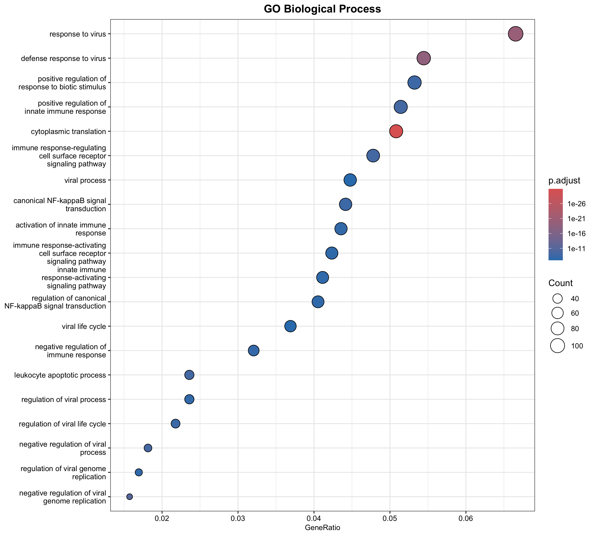

Top GO terms: cytoplasmic translation, response to virus, defense response to virus.

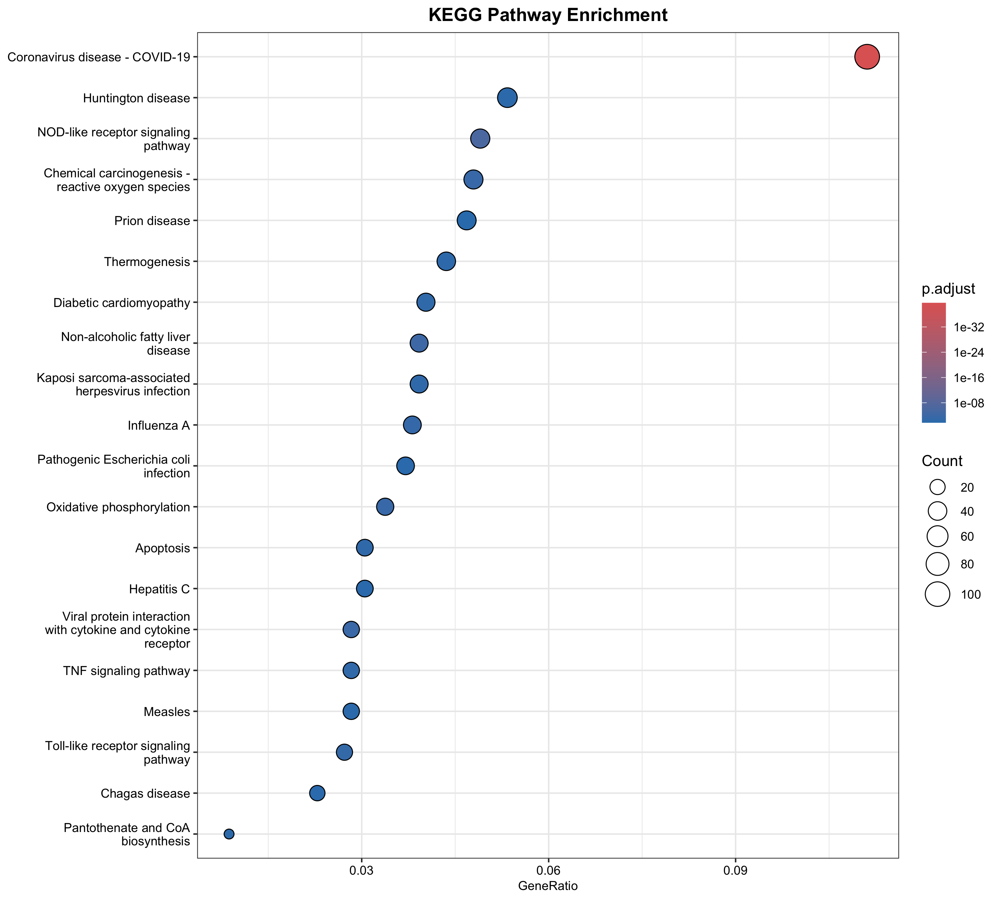

Top KEGG pathway: **Coronavirus disease - COVID-19** (FDR = 1.5×10<sup>-40</sup>), followed by NOD-like receptor signalling.

### ISG Signalling Cascade

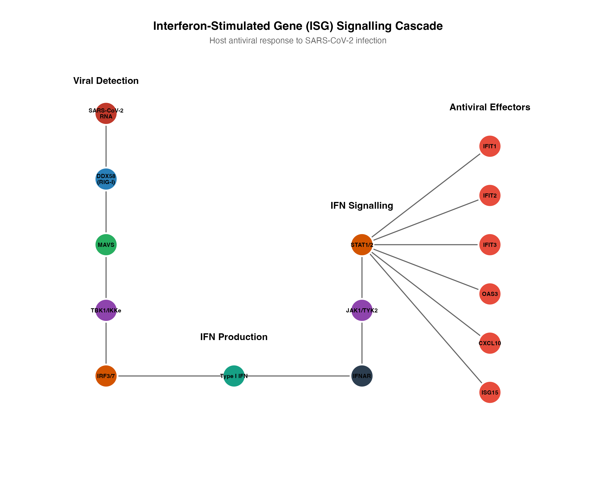

Schematic of RIG-I → IFN → ISG antiviral cascade. Viral RNA detection by DDX58 (RIG-I) triggers interferon production and downstream activation of antiviral effectors.

## Biological Interpretation

The transcriptional signature reflects innate antiviral immunity:

1. **Detection**: DDX58 (RIG-I) senses cytoplasmic viral RNA
2. **Signal transduction**: MAVS → TBK1 → IRF3/7 activation
3. **Interferon response**: Type I IFN production and signalling
4. **Effector functions**:
   - IFIT1/2/3: Block viral protein synthesis
   - OAS3: Activates RNase L for RNA degradation
   - CXCL10: Recruits effector lymphocytes

This response is protective during acute infection but may contribute to immunopathology in severe COVID-19.

## Quick Start
```r
# Install dependencies (first time only)
source("000_install_dependencies.R")

# Run complete pipeline
source("run_all.R")
```

Analysis runtime: ~0.5 min after data download (~2GB).

## Project Structure
```
bulk-rnaseq-differential-expression/
├── 000_install_dependencies.R   # Install all required packages
├── run_all.R                    # Run complete pipeline
├── scripts/
│   ├── 00_get_data.R
│   ├── 01_qc.R
│   ├── 02_pca.R
│   ├── 03_deseq2.R
│   ├── 04_visualisation_volcano.R
│   ├── 05_model_diagnostics.R
│   ├── 06_enrichment.R
│   ├── 07_reproducibility.R
│   └── 08_pathway_diagram.R
├── data/
│   └── [RDS files]
├── results/
│   ├── figures/
│   └── tables/
├── LICENSE
└── README.md
```

## Individual Scripts
```r
source("scripts/00_get_data.R")
source("scripts/01_qc.R")
source("scripts/02_pca.R")
source("scripts/03_deseq2.R")
source("scripts/04_visualisation_volcano.R")
source("scripts/05_model_diagnostics.R")
source("scripts/06_enrichment.R")
source("scripts/07_reproducibility.R")
source("scripts/08_pathway_diagram.R")
```

## Methods

### Quality Control
- Minimum library size: 100,000 reads
- Gene filtering: CPM ≥ 1 in ≥10 samples
- Final: 14,220 genes tested
- Balanced sampling: 30 per group (seed = 123)

### Statistical Analysis
- Normalisation: DESeq2 median-of-ratios
- Transformation: Variance-stabilising transformation (VST) for visualisation
- Dispersion: Empirical Bayes shrinkage
- Testing: Wald test with Benjamini-Hochberg correction
- Thresholds: FDR < 0.05, |log₂FC| > 1 (chosen after testing >0.58 and >1.5; this gave the cleanest ISG-dominant signal)

### Enrichment Analysis
- Gene ID conversion: Symbol → Entrez (96% mapped)
- GO: Biological Process, BH-corrected
- KEGG: Human pathways (hsa)

## Limitations

- Nasopharyngeal samples only; may not reflect lower respiratory tract
- Subset analysis reduces power but improves class balance (full cohort runs showed noisier PCA from viral-load imbalance)
- Cross-sectional design; no temporal dynamics
- Future extensions: full cohort analysis, batch correction assessment, or integration with scRNA-seq

## Requirements

### Bioconductor
```r
BiocManager::install(c("DESeq2", "edgeR", "GEOquery", 
                       "clusterProfiler", "org.Hs.eg.db", "enrichplot"))
```

### CRAN
```r
install.packages(c("ggplot2", "ggrepel", "dplyr", "pheatmap", "RColorBrewer"))
```

### System
- R ≥ 4.0
- 8GB RAM recommended
- ~2GB storage for GEO data

## Reproducibility

Session info recorded in `results/session_info.txt`. All random processes use fixed seeds.

## License

MIT

## Citation

This repository:
> Kahraman, E. (2026). SARS-CoV-2 Host Response in Nasopharyngeal RNA-seq. Zenodo. https://doi.org/10.5281/zenodo.18432519

Data from:
> Lieberman NAP *et al.* (2020) In vivo antiviral host transcriptional response to SARS-CoV-2 by viral load, sex, and age. *PLoS Biology* 18(9): e3000849. DOI: [10.1371/journal.pbio.3000849](https://doi.org/10.1371/journal.pbio.3000849)

## Author

**Ekin Kahraman**  
Molecular Biology & Genetics  
January 2026
